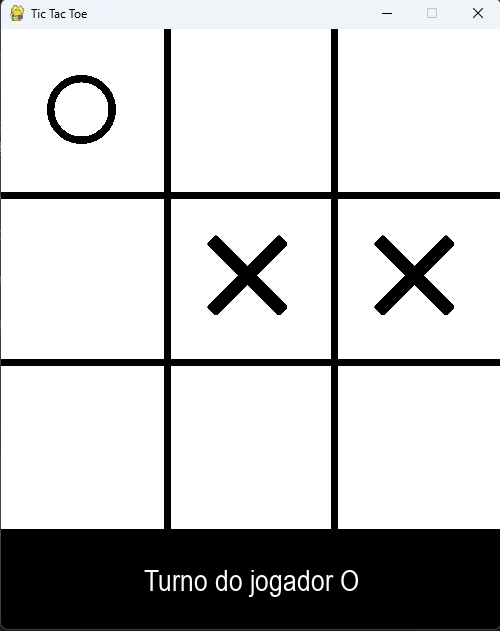
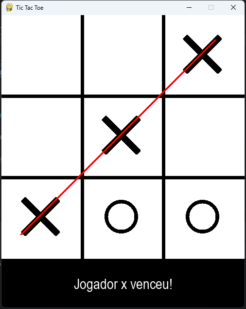
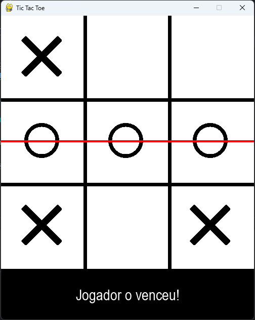
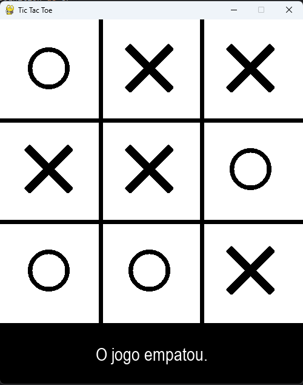

# Voice Controlled TicTacToe
 
### Packages used:
+ pygame
+ speech_recognition
+ time
+ sys
+ os

## Project Concept

This is a game project developed for the purpose of learning and training Speech Recognition
application as well as Pygame application.

This project only utilizes Global Variables and Functions to run, without the need
to create Classes.

|  |  |
|-------------------------|-------------------------|
|  |  |

### Global Variables

+ "speech_command" is the control variable that enables Speech Command feature;
+ "JOGADOR_XO" keeps track of each player's turn;
+ "VENCEDOR" keeps track of the winner;
+ "EMPATE" establishes whether the game was drawn or not;
+ "TELA_LARGURA" and "TELA_ALTURA" establishes the game screen size;
+ "COR_FUNDO" defines the background color;
+ "COR_LINHA" sets the color of the vertical and horizontal lines;
+ "TABULEIRO" creates a 3x3 board;
+ "fps" sets the frame in which the game will run;
+ "relogio" creates a clock object instance;
+ "tela" creates the screen object;
+ "rec" creates a Speech Recognizer instance;
+ "IMAGEM_BACKGROUND", "IMAGEM_X", "IMAGEM_O" loads the background, the X and the O images.

### Methods

+ "desenhar_tela" draw the screen and the lines using the established colors and images;
+ "desenhar_status" uses "VENCEDOR", "EMPATE" and "JOGADOR_XO" global variables
to display on screen the game current status;
+ "checar_vitoria" checks the "TABULEIRO" and changes "VENCEDOR" or "EMPATE" variables
depending on the board status, and then it draws the winner's red line;
+ "desenhar_XO" draws a "O" or an "X" at the specified position if the player clicks
on the screen or if the player uses a speech command;
+ "usuario_click" gets which column and line was specified by the player and gives
both parameters to "desenhar_XO" function;
+ "resetar_jogo" resets the "JOGADOR_XO", "VENCEDOR", "EMPATE" and the "TABULEIRO" varaibles
then it redraws the screen.